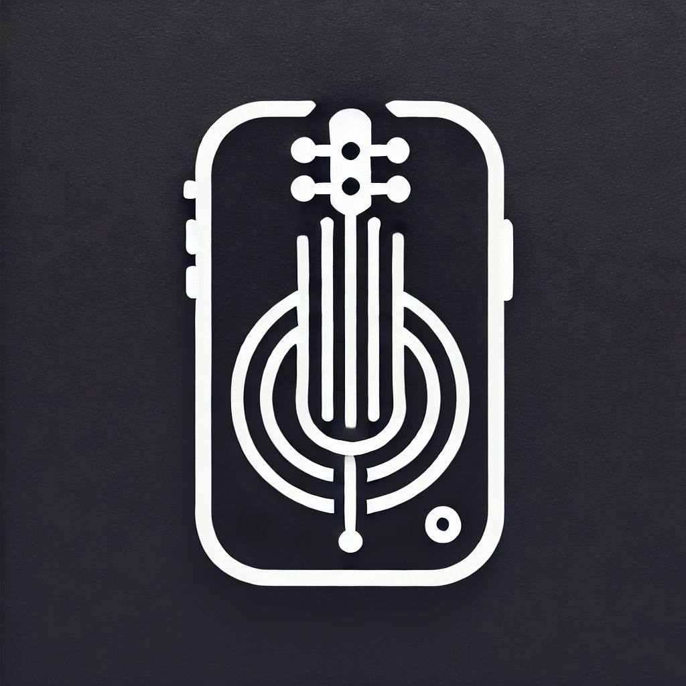

# Mini Guitar Tuner

A modern, responsive guitar tuner web application built with React and Tailwind CSS. This application supports multiple tuning configurations, features a real-time waveform display, and includes both light and dark themes.

**[Live app on GitHub Pages](https://makalin.github.io/mini-guitar-tuner)** — the tuner runs in your browser (not this README).



## Features

- 🎸 Multiple tuning presets:
  - Standard 6-string guitar
  - Drop D tuning
  - 7-string guitar
  - 8-string guitar
  - Bass guitar
- 🎼 Real-time pitch detection
- 📊 Live waveform visualization
- 🌓 Dark/Light theme support
- 📱 Responsive design
- 🎯 Visual tuning indicator
- 🎵 Accurate frequency detection
- ⚡ Low latency audio processing

## Tech Stack

- React
- Tailwind CSS
- shadcn/ui components
- Web Audio API
- Lucide React Icons

## Prerequisites

Before you begin, ensure you have the following installed:
- Node.js (v16 or higher)
- npm or yarn

## Installation

1. Clone the repository:
```bash
git clone https://github.com/makalin/mini-guitar-tuner.git
cd mini-guitar-tuner
```

2. Install dependencies:
```bash
npm install
# or
yarn install
```

3. Install required shadcn/ui components:
```bash
npx shadcn-ui@latest add card
npx shadcn-ui@latest add button
npx shadcn-ui@latest add alert
npx shadcn-ui@latest add switch
npx shadcn-ui@latest add select
```

4. Start the development server:
```bash
npm start
# or
yarn start
```

## Deploy to GitHub Pages (so the live link shows the app)

The live URL should serve the **built app**, not the README. Do this once:

1. **Build and push the app to the `gh-pages` branch:**
   ```bash
   npm run deploy
   ```
   This runs `npm run build` then publishes the `build/` folder to the `gh-pages` branch.

2. **In GitHub, set Pages to use that branch:**
   - Repo → **Settings** → **Pages**
   - Under **Build and deployment**, **Source**: choose **Deploy from a branch**
   - **Branch**: select **gh-pages** and **/ (root)**
   - Save

After a minute or two, https://makalin.github.io/mini-guitar-tuner/ will show the tuner app. If you still see this README, the source is still set to the default branch (e.g. `main`); switch it to **gh-pages** as above.

## Usage

1. Select your desired tuning from the dropdown menu
2. Click the "Start" button to begin pitch detection
3. Allow microphone access when prompted
4. Play a single string on your instrument
5. The tuner will display:
   - The closest note
   - The current frequency
   - A visual indicator showing if the note is sharp or flat
   - A real-time waveform of the audio input

## Contributing

Contributions are welcome! Please feel free to submit a Pull Request.

1. Fork the project
2. Create your feature branch (`git checkout -b feature/AmazingFeature`)
3. Commit your changes (`git commit -m 'Add some AmazingFeature'`)
4. Push to the branch (`git push origin feature/AmazingFeature`)
5. Open a Pull Request

## Technical Implementation

### Audio Processing

The tuner uses the Web Audio API for real-time audio processing:
- `AudioContext` for audio processing
- `AnalyserNode` for frequency analysis
- Zero-crossing detection for pitch identification
- Real-time waveform visualization using SVG

### Tuning Configurations

Each tuning preset includes:
- Note names (e.g., E2, A2, D3)
- Precise frequencies in Hz
- Appropriate frequency ranges for detection

### Theme Management

The application implements a theme system that:
- Persists theme preference
- Provides smooth transitions between themes
- Ensures proper contrast in both modes
- Properly styles all UI components

## License

This project is licensed under the MIT License - see the LICENSE file for details.

## Acknowledgments

- [shadcn/ui](https://ui.shadcn.com/) for the beautiful UI components
- [Lucide](https://lucide.dev/) for the icons
- Web Audio API for audio processing capabilities

## Configuration

### Available Tunings

```javascript
const TUNINGS = {
  'standard': {
    name: 'Standard (6 String)',
    notes: ['E2', 'A2', 'D3', 'G3', 'B3', 'E4']
  },
  'drop-d': {
    name: 'Drop D',
    notes: ['D2', 'A2', 'D3', 'G3', 'B3', 'E4']
  },
  '7-string': {
    name: '7 String',
    notes: ['B1', 'E2', 'A2', 'D3', 'G3', 'B3', 'E4']
  },
  '8-string': {
    name: '8 String',
    notes: ['F#1', 'B1', 'E2', 'A2', 'D3', 'G3', 'B3', 'E4']
  },
  'bass': {
    name: 'Bass Guitar',
    notes: ['E1', 'A1', 'D2', 'G2']
  }
}
```

## Browser Support

The application requires a modern browser with support for:
- Web Audio API
- MediaDevices API
- ES6+ JavaScript features

## Known Issues

- Some browsers may require HTTPS for microphone access
- Performance may vary depending on system audio capabilities
- Mobile device support may vary by device and browser
